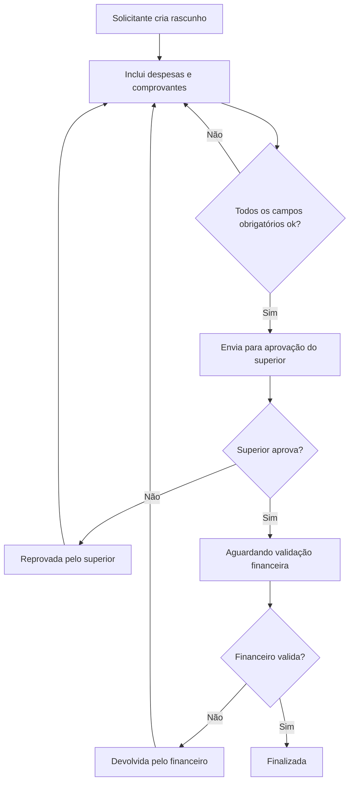

# Desenho técnico - APP de Reembolso e Prestação de Contas

## 1. Objetivo

Criar um APP responsivo para controlar adiantamentos de despesas, prestação de contas, anexos de comprovantes, aprovação do superior, validação financeira e histórico completo do processo.

O sistema deve permitir que o solicitante registre despesas pelo computador ou celular, envie comprovantes por foto, acompanhe aprovações e receba avisos por e-mail e pela própria aplicação.

## 2. Recomendação de arquitetura

### Opção recomendada para o MVP

Construir como um novo módulo dentro do sistema atual da Redefrete.

Motivos:

- reaproveita login, usuários, permissões e layout já existentes;
- reaproveita envio de e-mails pelo Microsoft Graph;
- reaproveita MySQL já configurado;
- reduz tempo de desenvolvimento;
- permite publicar tudo no mesmo servidor/VM.

### Evolução futura

Depois do MVP, o módulo pode virar um APP separado ou PWA mobile, mantendo o mesmo backend e banco de dados.

## 3. Perfis de acesso

### Solicitante

Pode:

- cadastrar solicitação de adiantamento;
- criar prestação de contas;
- incluir despesas;
- anexar comprovantes;
- enviar para aprovação;
- corrigir quando reprovado;
- consultar histórico próprio.

Não pode:

- aprovar a própria prestação;
- finalizar prestação;
- alterar após envio, exceto quando devolvido para ajuste.

### Superior / Gestor

Pode:

- visualizar prestações pendentes da sua equipe;
- aprovar;
- reprovar com justificativa;
- consultar histórico da equipe.

Não pode:

- alterar despesas do solicitante;
- finalizar financeiramente.

### Financeiro

Pode:

- validar prestações aprovadas pelo superior;
- conferir valores, comprovantes e saldos;
- devolver para ajuste com justificativa;
- finalizar;
- consultar painel geral;
- gerar relatórios.

### Administrador

Pode:

- configurar usuários, perfis e permissões;
- configurar tipos de despesa;
- configurar centros de custo/unidades;
- configurar políticas;
- configurar textos de e-mail;
- reabrir/cancelar processos quando necessário.

## 4. Menus sugeridos

### Para o solicitante

- Meu painel
- Meus adiantamentos
- Minhas prestações
- Nova prestação
- Notificações

### Para o gestor

- Aprovações pendentes
- Histórico da equipe

### Para o financeiro

- Painel financeiro
- Prestações em validação
- A pagar
- A receber/devolver
- Relatórios
- Cadastros auxiliares

### Para o administrador

- Usuários e permissões
- Centros de custo
- Tipos de despesa
- Políticas
- Textos dos e-mails
- Auditoria

## 5. Telas do sistema

### 5.1 Painel inicial

Deve mostrar os indicadores conforme o perfil do usuário:

- adiantamentos abertos;
- prestações em rascunho;
- prestações aguardando aprovação;
- prestações reprovadas;
- prestações aguardando financeiro;
- valores a reembolsar;
- valores a devolver;
- pendências de comprovantes.

### 5.2 Cadastro de adiantamento

Campos:

- número automático;
- solicitante;
- data do adiantamento;
- valor;
- descritivo;
- finalidade;
- centro de custo;
- unidade;
- superior aprovador;
- status.

Status do adiantamento:

- aberto;
- prestado;
- aprovado;
- reprovado;
- finalizado;
- cancelado.

Regra inicial:

- No MVP, usar 1 adiantamento para 1 prestação de contas.
- Futuramente pode permitir várias prestações para o mesmo adiantamento.

### 5.3 Prestação de contas

Cabeçalho:

- número sequencial automático;
- solicitante;
- departamento;
- cargo;
- superior;
- finalidade;
- data inicial;
- data final;
- adiantamento vinculado;
- valor adiantado;
- status.

Resumo:

- total de refeições;
- total de transporte;
- total de pedágio;
- total de outros;
- total de quilometragem;
- total geral;
- saldo a devolver;
- valor a reembolsar;
- quantidade de despesas;
- quantidade de comprovantes pendentes.

### 5.4 Inclusão de despesas

Campos por despesa:

- data;
- tipo de despesa;
- descrição;
- valor;
- início do trajeto, quando for quilometragem;
- fim do trajeto, quando for quilometragem;
- quantidade de KM;
- valor calculado de KM;
- anexo do comprovante;
- status do comprovante;
- observação.

Tipos iniciais:

- refeição;
- transporte;
- pedágio;
- estacionamento;
- hospedagem;
- quilometragem;
- outros.

Regra de quilometragem:

- Deve usar o valor configurado por KM.
- Deve exigir evidência do trajeto, como foto do Google Maps ou similar.

### 5.5 Upload e leitura do documento fiscal

No MVP:

- permitir upload/foto do comprovante;
- guardar arquivo;
- permitir conferência manual pelo solicitante.

Na etapa 2:

- OCR para tentar ler CNPJ, data, valor, número do documento e razão social;
- preencher automaticamente os campos lidos;
- permitir correção manual;
- marcar divergência quando o valor lido for diferente do valor lançado.

### 5.6 Tela de aprovação do superior

Deve mostrar:

- dados do solicitante;
- finalidade;
- período;
- valor adiantado;
- total gasto;
- saldo a devolver ou reembolsar;
- despesas detalhadas;
- comprovantes;
- histórico de comentários.

Ações:

- aprovar;
- reprovar com justificativa.

Quando reprovar:

- volta para o solicitante;
- exige ajuste;
- registra a justificativa;
- dispara e-mail e notificação no APP.

### 5.7 Tela de validação financeira

Deve mostrar:

- tudo que o superior viu;
- conferência de comprovantes;
- conferência de valores;
- saldo financeiro;
- dados para pagamento ou devolução.

Ações:

- finalizar;
- devolver para ajuste;
- cancelar, se permitido por perfil.

### 5.8 Relatório

Gerar relatório com aparência formal, semelhante a uma prestação de contas corporativa:

- logo Redefrete;
- número da prestação;
- solicitante;
- centro de custo;
- unidade;
- período;
- finalidade;
- resumo financeiro;
- lista de despesas;
- relação de comprovantes;
- aprovações;
- datas e autenticações.

## 6. Fluxo de status



Status da prestação:

- rascunho;
- enviada_superior;
- reprovada_superior;
- aprovada_superior;
- em_validacao_financeira;
- reprovada_financeiro;
- finalizada;
- cancelada.

## 7. Modelo MySQL sugerido

### 7.1 `reembolso_tipos_despesa`

| Campo | Tipo | Observação |
| --- | --- | --- |
| id | bigint PK | automático |
| nome | varchar(100) | exemplo: Refeição |
| codigo | varchar(50) | uso interno |
| exige_comprovante | tinyint | padrão 1 |
| exige_km | tinyint | padrão 0 |
| ativo | tinyint | padrão 1 |
| created_at | datetime | |
| updated_at | datetime | |

### 7.2 `reembolso_centros_custo`

| Campo | Tipo | Observação |
| --- | --- | --- |
| id | bigint PK | automático |
| nome | varchar(150) | |
| codigo | varchar(50) | opcional |
| unidade_id | bigint | se reaproveitar tabela de unidades |
| ativo | tinyint | padrão 1 |
| created_at | datetime | |
| updated_at | datetime | |

### 7.3 `reembolso_adiantamentos`

| Campo | Tipo | Observação |
| --- | --- | --- |
| id | bigint PK | automático |
| numero | varchar(30) | sequencial |
| solicitante_id | bigint | usuário solicitante |
| superior_id | bigint | usuário aprovador |
| data_adiantamento | date | |
| valor | decimal(15,2) | |
| descritivo | text | |
| finalidade | text | |
| centro_custo_id | bigint | |
| unidade_id | bigint | |
| status | varchar(40) | aberto/prestado/aprovado/etc. |
| created_at | datetime | |
| updated_at | datetime | |

Índices:

- `idx_adiantamento_solicitante`
- `idx_adiantamento_status`
- `idx_adiantamento_data`

### 7.4 `reembolso_prestacoes`

| Campo | Tipo | Observação |
| --- | --- | --- |
| id | bigint PK | automático |
| numero | varchar(30) | sequencial |
| adiantamento_id | bigint | opcional, mas recomendado no MVP |
| solicitante_id | bigint | |
| superior_id | bigint | |
| financeiro_id | bigint | preenchido na finalização |
| centro_custo_id | bigint | |
| unidade_id | bigint | |
| finalidade | text | |
| data_inicio | date | |
| data_fim | date | |
| valor_adiantado | decimal(15,2) | |
| total_despesas | decimal(15,2) | calculado/salvo |
| saldo_devolver | decimal(15,2) | calculado/salvo |
| valor_reembolsar | decimal(15,2) | calculado/salvo |
| status | varchar(40) | fluxo principal |
| enviado_em | datetime | |
| aprovado_superior_em | datetime | |
| finalizado_em | datetime | |
| motivo_reprovacao | text | última justificativa |
| created_at | datetime | |
| updated_at | datetime | |

Índices:

- `idx_prestacao_numero`
- `idx_prestacao_solicitante`
- `idx_prestacao_superior`
- `idx_prestacao_status`
- `idx_prestacao_periodo`

### 7.5 `reembolso_despesas`

| Campo | Tipo | Observação |
| --- | --- | --- |
| id | bigint PK | automático |
| prestacao_id | bigint | |
| tipo_despesa_id | bigint | |
| data_despesa | date | |
| descricao | text | |
| valor | decimal(15,2) | |
| origem | varchar(200) | para KM/transporte |
| destino | varchar(200) | para KM/transporte |
| quantidade_km | decimal(10,2) | |
| valor_km | decimal(10,2) | valor aplicado no cálculo |
| status_comprovante | varchar(40) | pendente/anexado/validado/divergente |
| observacao | text | |
| created_at | datetime | |
| updated_at | datetime | |

Índices:

- `idx_despesa_prestacao`
- `idx_despesa_tipo`
- `idx_despesa_data`

### 7.6 `reembolso_comprovantes`

| Campo | Tipo | Observação |
| --- | --- | --- |
| id | bigint PK | automático |
| despesa_id | bigint | |
| nome_original | varchar(255) | |
| caminho_arquivo | varchar(500) | |
| mime_type | varchar(100) | |
| tamanho_bytes | bigint | |
| ocr_status | varchar(40) | pendente/lido/erro |
| ocr_texto | longtext | texto bruto lido |
| ocr_cnpj | varchar(20) | |
| ocr_data | date | |
| ocr_valor | decimal(15,2) | |
| ocr_numero_documento | varchar(100) | |
| created_at | datetime | |

### 7.7 `reembolso_aprovacoes`

| Campo | Tipo | Observação |
| --- | --- | --- |
| id | bigint PK | automático |
| prestacao_id | bigint | |
| usuario_id | bigint | |
| etapa | varchar(40) | superior/financeiro |
| decisao | varchar(30) | aprovado/reprovado/finalizado |
| justificativa | text | |
| autenticacao | varchar(50) | código gerado |
| created_at | datetime | |

### 7.8 `reembolso_historico`

| Campo | Tipo | Observação |
| --- | --- | --- |
| id | bigint PK | automático |
| prestacao_id | bigint | |
| usuario_id | bigint | |
| acao | varchar(100) | |
| descricao | text | |
| dados_json | json | |
| created_at | datetime | |

### 7.9 `reembolso_configuracoes`

| Campo | Tipo | Observação |
| --- | --- | --- |
| chave | varchar(100) PK | exemplo: valor_km |
| valor | text | |
| updated_at | datetime | |

Configurações iniciais:

- valor_km;
- prazo_prestacao_dias;
- exigir_comprovante_todos;
- permitir_despesa_fora_periodo;
- permitir_adiantamento_sem_aprovacao;

## 8. APIs sugeridas

### Painel

- `GET /api/reembolso/dashboard`

### Adiantamentos

- `GET /api/reembolso/adiantamentos`
- `POST /api/reembolso/adiantamentos`
- `GET /api/reembolso/adiantamentos/:id`
- `PUT /api/reembolso/adiantamentos/:id`
- `POST /api/reembolso/adiantamentos/:id/cancelar`

### Prestações

- `GET /api/reembolso/prestacoes`
- `POST /api/reembolso/prestacoes`
- `GET /api/reembolso/prestacoes/:id`
- `PUT /api/reembolso/prestacoes/:id`
- `POST /api/reembolso/prestacoes/:id/enviar-aprovacao`
- `POST /api/reembolso/prestacoes/:id/aprovar-superior`
- `POST /api/reembolso/prestacoes/:id/reprovar-superior`
- `POST /api/reembolso/prestacoes/:id/finalizar-financeiro`
- `POST /api/reembolso/prestacoes/:id/devolver-financeiro`
- `POST /api/reembolso/prestacoes/:id/cancelar`

### Despesas

- `POST /api/reembolso/prestacoes/:id/despesas`
- `PUT /api/reembolso/despesas/:id`
- `DELETE /api/reembolso/despesas/:id`

### Comprovantes

- `POST /api/reembolso/despesas/:id/comprovantes`
- `GET /api/reembolso/comprovantes/:id/download`
- `DELETE /api/reembolso/comprovantes/:id`
- `POST /api/reembolso/comprovantes/:id/ocr`

### Cadastros

- `GET /api/reembolso/tipos-despesa`
- `POST /api/reembolso/tipos-despesa`
- `PUT /api/reembolso/tipos-despesa/:id`
- `GET /api/reembolso/centros-custo`
- `POST /api/reembolso/centros-custo`
- `PUT /api/reembolso/centros-custo/:id`

### Relatórios

- `GET /api/reembolso/prestacoes/:id/relatorio`
- `GET /api/reembolso/relatorios/financeiro`
- `GET /api/reembolso/relatorios/colaborador/:usuarioId`

## 9. Regras de cálculo

### Total de despesas

```text
total_despesas = soma(valor das despesas)
```

### Saldo a devolver

```text
saldo_devolver = valor_adiantado - total_despesas
```

Se o resultado for menor que zero, considerar zero.

### Valor a reembolsar

```text
valor_reembolsar = total_despesas - valor_adiantado
```

Se o resultado for menor que zero, considerar zero.

### Quilometragem

```text
valor_km_calculado = quantidade_km * valor_km_configurado
```

## 10. Validações obrigatórias

Antes de enviar para aprovação:

- possuir solicitante;
- possuir finalidade;
- possuir período;
- possuir pelo menos uma despesa;
- todas as despesas devem ter data, tipo, descrição e valor;
- despesas com comprovante obrigatório devem ter anexo;
- KM deve ter origem, destino, quantidade de KM e evidência do trajeto;
- totalizadores devem estar recalculados.

Antes do financeiro finalizar:

- superior deve ter aprovado;
- comprovantes devem estar conferidos;
- divergências devem estar resolvidas ou justificadas;
- deve existir decisão sobre saldo a devolver ou valor a reembolsar.

## 11. Notificações e e-mails

Eventos que devem disparar aviso:

- adiantamento criado;
- prestação enviada para aprovação;
- superior aprovou;
- superior reprovou;
- financeiro devolveu;
- financeiro finalizou;
- comprovante pendente;
- prazo de prestação vencendo;
- prazo de devolução vencendo.

Os textos devem ser editáveis no sistema, seguindo o padrão já criado para os e-mails de folha/rescisão.

Variáveis úteis:

- `{{numero}}`
- `{{solicitante}}`
- `{{superior}}`
- `{{valor_adiantado}}`
- `{{total_despesas}}`
- `{{saldo_devolver}}`
- `{{valor_reembolsar}}`
- `{{status}}`
- `{{link}}`
- `{{justificativa}}`

## 12. Ordem de implementação do MVP

### Fase 1 - Estrutura

- Criar tabelas.
- Criar permissões.
- Criar menus.
- Criar cadastros de tipos de despesa e centros de custo.

### Fase 2 - Adiantamentos

- Cadastro/listagem de adiantamentos.
- Status inicial.
- Vinculação com solicitante, superior, centro de custo e unidade.

### Fase 3 - Prestação de contas

- Criar prestação vinculada ao adiantamento.
- Lançar despesas.
- Upload de comprovantes.
- Totalizadores automáticos.

### Fase 4 - Aprovação

- Enviar para aprovação.
- Aprovar/reprovar pelo superior.
- Devolver para ajuste.
- Notificações e e-mails.

### Fase 5 - Financeiro

- Painel financeiro.
- Validação final.
- Finalização.
- Relatório PDF/HTML.

### Fase 6 - OCR e mobile

- Leitura automática de comprovantes.
- Tela mobile otimizada para foto.
- Conferência automática de CNPJ, data, valor e número do documento.

## 13. Decisões pendentes

Antes de começar o desenvolvimento, vale confirmar:

- O fluxo terá apenas superior e financeiro, ou também diretor?
- O adiantamento precisa ser aprovado antes de liberar o valor?
- Pode existir prestação sem adiantamento, apenas para reembolso?
- O financeiro poderá alterar valores ou apenas devolver para o solicitante corrigir?
- Qual será o prazo máximo para prestar contas após o adiantamento?
- O saldo a devolver será controlado no sistema ou apenas informado no relatório?

