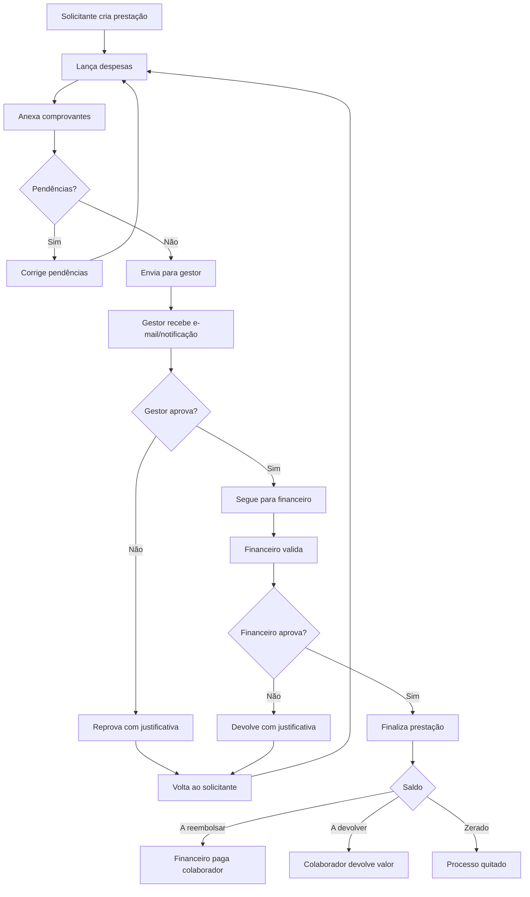

# APP de Reembolso e Prestação de Contas

## Objetivo

Criar um sistema para controlar adiantamentos de despesas, prestação de contas, anexos de comprovantes, aprovação hierárquica e validação financeira.

O sistema deve substituir a planilha atual de reembolso, mantendo a lógica principal:

- identificação do solicitante;
- finalidade da despesa;
- período da prestação;
- despesas lançadas uma a uma;
- totalização por tipo;
- comparação entre valor adiantado e valor comprovado;
- aprovação do gestor;
- validação/finalização pelo financeiro.

## Campos observados na planilha

### Cabeçalho

- Nome
- Departamento
- Cargo
- Gerente
- Finalidade
- Data de início
- Data de término
- Aprovado por

### Parâmetros e resumo

- Valor por quilometragem
- Adiantamentos
- Refeições
- Transporte / quilometragem
- Pedágio
- Outros
- Total do relatório de despesas
- Total a receber ou devolver

### Itens de despesa

- Data
- Descrição
- Refeições
- Transporte
- Pedágio
- KM Início
- KM Fim
- KM Total
- Outros
- Total

### Observação obrigatória

É obrigatório anexar os comprovantes de despesas descritos no relatório. Os valores serão pagos conforme as evidências desses comprovantes.
No caso dos KMs, deve-se anexar uma foto do Maps Google ou similar, evidenciando a quantidade de KM percorrido.

## Perfis de acesso

### Solicitante

Pessoa que recebe ou solicita adiantamento, solicita autorizacao para seu superior, e aprovado vai para o financeiro, se reprovado volta para o solicitante 
Depois ele lança despesas e envia a prestação para aprovação.

Permissões:

- criar prestação de contas;
- lançar despesas;
- anexar comprovantes;
- editar enquanto estiver em rascunho ou reprovado;
- enviar para aprovação;
- acompanhar status;
- visualizar histórico próprio.

### Gestor / Superior

Pessoa responsável por aprovar ou reprovar a prestação.

Permissões:

- visualizar prestações de sua equipe;
- aprovar;
- reprovar com justificativa;
- devolver para ajuste;
- visualizar comprovantes.

### Financeiro

Pessoa responsável por validar os dados finais, enviar para o Omie, confirmar pagamento ou devolução e finalizar.

Permissões:

- visualizar todas as prestações;
- validar comprovantes;
- ajustar classificação, se permitido;
- confirmar valor a pagar ou a receber;
- finalizar prestação;
- emitir relatório;
- consultar histórico por colaborador, unidade e centro de custo.

### Administrador

Pessoa responsável por configurações.

Permissões:

- usuários e perfis;
- tipos de despesa;
- centros de custo;
- unidades;
- limites e políticas;
- parâmetros de quilometragem;
- textos de e-mail/notificação.

## Cadastros necessários

### Usuários

- nome;
- e-mail;
- telefone;
- perfil;
- gestor vinculado;
- departamento;
- cargo;
- unidade;
- centro de custo;
- ativo/inativo.

### Tipos de despesa

Exemplos:

- alimentação;
- transporte;
- hospedagem;
- estacionamento;
- pedágio;
- combustível;
- quilometragem;
- outros.

Campos:

- nome;
- exige comprovante;
- permite OCR;
- exige origem/destino;
- exige quilometragem;
- limite por lançamento, se houver;
- ativo/inativo.

### Categorias
- Nesse caso sempre "Reembolso de Despesas"

### Centros de custo / unidades

- nome;
- código;
- responsável;
- ativo/inativo.

### Parâmetros

- valor por km;
- e-mail do financeiro;
- prazo padrão para prestação de contas;
- política de aprovação;
- formatos aceitos de anexo;
- tamanho máximo de arquivo.

## Módulo de adiantamento

### Campos

- número do adiantamento;
- solicitante;
- data do adiantamento;
- valor;
- descritivo;
- finalidade;
- centro de custo;
- unidade;
- status;
- criado por;
- data de criação.

### Status

- aberto;
- vinculado à prestação;
- prestado;
- aprovado;
- reprovado;
- finalizado;
- cancelado.

### Regras

- Um adiantamento pode estar vinculado a uma ou mais prestações, se a empresa permitir.
- No MVP, recomenda-se começar com 1 adiantamento para 1 prestação.
- Adiantamento finalizado não pode ser alterado.
- Adiantamento com prestação enviada não pode ser excluído.
- Se o total das despesas for menor que o adiantamento, gera saldo a devolver.
- Se o total das despesas for maior que o adiantamento, gera valor a reembolsar.

## Módulo de prestação de contas

### Campos principais

- número sequencial automático;
- solicitante;
- adiantamento vinculado;
- finalidade;
- data de início;
- data de término;
- departamento;
- cargo;
- gerente;
- unidade;
- centro de custo;
- status;
- total de despesas;
- valor adiantado;
- saldo a devolver;
- valor a reembolsar;
- data de envio;
- data de aprovação;
- data de finalização.

### Status

- rascunho;
- enviada para aprovação;
- reprovada pelo gestor;
- aprovada pelo gestor;
- em validação financeira;
- reprovada pelo financeiro;
- finalizada;
- cancelada.

### Regras

- O número da prestação deve ser sequencial e automático.
- O solicitante pode editar apenas em rascunho ou quando a prestação for reprovada.
- Após envio para aprovação, a prestação fica bloqueada para edição.
- O gestor deve informar justificativa em caso de reprovação.
- O financeiro deve informar justificativa se devolver para ajuste.
- A finalização bloqueia qualquer alteração.
- Todo lançamento com tipo que exige comprovante deve ter anexo.
- A prestação não pode ser enviada se houver pendência obrigatória.

## Itens de despesa

### Campos

- prestação vinculada;
- data da despesa;
- tipo da despesa;
- descrição;
- valor;
- comprovante;
- número do documento;
- CNPJ do emitente;
- data lida do documento;
- valor lido do documento;
- status da leitura;
- observação;
- origem;
- destino;
- km inicial;
- km final;
- km calculado;
- valor por km;
- valor calculado por km.

### Regras

- A despesa deve estar dentro do período da prestação, salvo exceção aprovada.
- O total do item pode ser manual ou calculado, conforme tipo.
- Para quilometragem:
  - km calculado = km final - km inicial;
  - valor = km calculado x valor por km.
- Para despesa com comprovante obrigatório, não permitir envio sem anexo.
- O comprovante pode ser imagem, PDF ou XML, conforme configuração.
- Cada item deve preservar histórico de alterações relevantes.

## Leitura do documento fiscal

### MVP

No primeiro momento:

- upload da foto ou PDF;
- preenchimento manual pelo solicitante;
- conferência manual pelo financeiro.

### Etapa 2

Com OCR:

- ler CNPJ;
- ler número do documento;
- ler data;
- ler valor total;
- comparar valor lido com valor informado;
- alertar divergências;
- permitir correção manual.

### Status da leitura

- não processado;
- lido;
- lido com divergência;
- leitura falhou;
- conferido manualmente.

## Resumo automático

O sistema deve calcular:

- valor adiantado;
- total de despesas;
- total por tipo de despesa;
- saldo a devolver;
- valor a reembolsar;
- pendências de comprovante;
- divergências de OCR;
- quantidade de despesas;
- período da prestação.

### Fórmula

```text
saldo = valor adiantado - total de despesas
```

Se saldo > 0:

```text
colaborador deve devolver saldo
```

Se saldo < 0:

```text
empresa deve reembolsar abs(saldo)
```

Se saldo = 0:

```text
prestação quitada
```

## Fluxo de aprovação



## Notificações

### E-mail

Eventos:

- prestação enviada para gestor;
- reprovação pelo gestor;
- aprovação pelo gestor;
- envio ao financeiro;
- reprovação pelo financeiro;
- finalização;
- pendência de comprovante;
- solicitação de devolução;
- confirmação de reembolso.

### Mensagens no APP

O sistema deve ter uma área de mensagens/notificações internas com:

- destinatário;
- origem;
- tipo;
- mensagem;
- link para a prestação;
- lido/não lido;
- data de criação.

## Painel do solicitante

Indicadores:

- minhas prestações em rascunho;
- aguardando aprovação;
- reprovadas para ajuste;
- aprovadas;
- finalizadas;
- valores a receber;
- valores a devolver.

## Painel do gestor

Indicadores:

- prestações pendentes de aprovação;
- aprovadas no mês;
- reprovadas no mês;
- valores por colaborador;
- valores por centro de custo.

## Painel financeiro

Indicadores:

- prestações aguardando validação;
- aprovadas pelo gestor;
- reprovadas;
- finalizadas;
- a pagar;
- a receber/devolver;
- histórico por colaborador;
- histórico por unidade;
- histórico por centro de custo.

## Relatórios

### Relatório de prestação de contas

Deve conter:

- número da prestação;
- solicitante;
- departamento;
- cargo;
- gerente;
- finalidade;
- período;
- valor adiantado;
- despesas por tipo;
- lista de despesas;
- anexos;
- saldo;
- aprovações;
- justificativas;
- histórico.

### Exportações

- PDF;
- Excel;
- CSV para financeiro, se necessário.

## Modelo de dados sugerido

### usuarios

- id
- nome
- email
- telefone
- perfil
- gestor_id
- departamento_id
- cargo
- unidade_id
- centro_custo_id
- ativo

### adiantamentos

- id
- numero
- solicitante_id
- data_adiantamento
- valor
- descritivo
- finalidade
- unidade_id
- centro_custo_id
- status
- criado_em

### prestacoes_contas

- id
- numero
- adiantamento_id
- solicitante_id
- gerente_id
- finalidade
- data_inicio
- data_termino
- status
- valor_adiantado
- total_despesas
- saldo_devolver
- valor_reembolsar
- enviado_em
- aprovado_gestor_em
- finalizado_em

### despesas

- id
- prestacao_id
- data_despesa
- tipo_despesa_id
- descricao
- valor
- origem
- destino
- km_inicio
- km_fim
- km_total
- valor_km
- valor_calculado
- status_comprovante
- observacao

### comprovantes

- id
- despesa_id
- original_name
- stored_name
- mime_type
- file_size
- ocr_cnpj
- ocr_data
- ocr_numero
- ocr_valor
- ocr_status
- divergencias
- criado_em

### aprovacoes

- id
- prestacao_id
- etapa
- aprovador_id
- status
- justificativa
- aprovado_em
- codigo_autenticacao

### notificacoes

- id
- usuario_id
- tipo
- titulo
- mensagem
- link
- lido
- criado_em

### tipos_despesa

- id
- nome
- exige_comprovante
- exige_quilometragem
- ativo

### centros_custo

- id
- codigo
- nome
- ativo

### unidades

- id
- nome
- ativo

## MVP recomendado

### Fase 1

- Login e perfis.
- Cadastro de usuários.
- Cadastro de tipos de despesa.
- Cadastro de adiantamento.
- Prestação de contas.
- Itens de despesa.
- Upload manual de comprovantes.
- Aprovação do gestor.
- Validação do financeiro.
- Resumo automático.
- Relatório PDF.

### Fase 2

- OCR de comprovantes.
- Conferência automática de valor, CNPJ, data e número.
- Alertas de divergência.
- Leitura por foto no smartphone.

### Fase 3

- App mobile/PWA.
- Notificações push.
- Integração contábil/ERP.
- Políticas de limite por tipo de despesa.

## Regras críticas para desenvolvimento

- Nenhum valor final deve depender apenas de texto livre.
- Toda despesa reembolsável deve ter tipo, data, valor e comprovante quando obrigatório.
- Toda reprovação deve exigir justificativa.
- Toda aprovação deve gerar registro com usuário, data e autenticação.
- Prestação finalizada não pode ser alterada.
- O financeiro deve conseguir ver a composição completa antes de finalizar.
- O solicitante deve conseguir corrigir apenas quando o fluxo voltar para ajuste.
